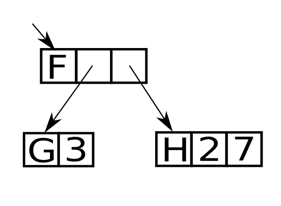
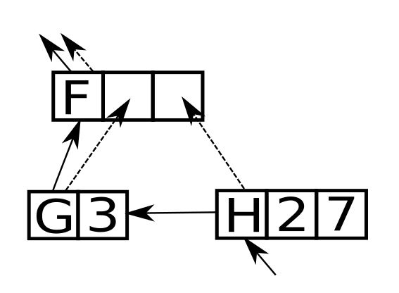

<html markdown="1">
<head>
<link rel="stylesheet" href="css/main.css">
</head>
<body markdown="1">
# Operational Semantics of Eager Combinator Rewriting

I got some questions on how the Egel interpreter evaluates terms. The operational semantics of the eager combinator rewrite system I use is embarrassingly facile and trivial to explain with two pictures, so here goes.

## Term evaluation
Say, you have a term language where you want to rewrite an expression consisting of combinators. In Egel's case, each 
combinator knows how to rewrite itself, therefore, corresponds to a procedure or some code. Below, the graphical
representation of the term "F (G 3) (H 2 7)".

You could use a stack and push stack frames for "F", "G", and "H". However, I wanted to experiment with another model, graph 
rewriting. 
Note that since we're rewriting eagerly we're rewriting the outermost expression first.

The operational semantics Egel uses shown below is extremely simplistic: *Start* with the node which is to be rewritten first,
*store* the result where necessary -the dotted line-, and *continue* with the next node to rewrite -the straight line-.

In this example, the node "H 2 7" is reduced first. Two things can happen: That node may reduce to a constant 
in which case the result is stored into the thunk of "F" and evaluation progresses with "G 3". Or "H 2 7" requires more
calculation, in which case the graph is expanded with the result of applying "H" to "2" and "7".

That's it. Note that the result is still a directed acyclic graph. That's what enables me to implement Egel's interpreter with native C++ reference counted pointers.

**Note:** For presentation reasons, the above pictures don't completely correspond to the model coded in C++, where an OO
hierarchy of nodes and arrays of pointers to nodes is used.

## Invariants

The byte code generated by the Egel interpreter must maintain some invariants. That is, 
a) the 'stack'/'spine' forms a directed acyclic graph and b) the results calculated are such graphs too.

## Drawbacks

The method described is, of course, a slow and restrictive manner of evaluation.
+ For one, stack based evaluators are simply faster because pushing data to, or popping from, a stack is less 
  computationally expensive than allocating, and deallocating, heap nodes.
+ Also, it's a term rewrite system so you can't allow for assignment since that would usually allow you to 
  create cyclic structures.
+ In order to allow for a more expressive input language, a technique called combinator lifting is needed. That
  technique results in prohibitively slow code since it 'recaptures' variables in the context.

## Advantages

The benefits of this model are threefold.

+ First, you don't run out of stack space which is really important in a functional language as I have experienced, 
  unfortunately. It's a slow but extremely robust mode of operation. Too often have I faced that with functional 
  programming you test your code on small input, to have it explode on larger input. What's the point of functional
  programming if you're going to run out of stack space when using recursion?
+ Second, it is still a tree rewrite system so I don't need to care about tail call optimization. That is, say for "fac 5"
  the node is rewritten to the nodes corresponding to "5 * fac 4"; i.e., in classical terms, the stack frame is dropped and
  replaced. That is, naive factorial still takes O(n) space but a tail recursive one should take O(1).
  And, no, that doesn't generalize to most other languages, it's just an advantage of term rewriting.
+ Third, since the semantics still rewrites trees, or directed acyclic graphs, you can implement it with nothing more than
  reference counting. In this case using C++'s shared pointers which has some additional benefits regarding predictable
  behavior, punctual disposing of resources, and concurrent evaluation.

I simply like this model of evaluation, there isn't much more to it. Some difficulties with 
this model are not discussed here.

**Notes:** Yes, what is shown are thunks or heap allocated stack frames. No, this isn't done with CPS though it is much akin to that. Please note that CPS is a source-to-source transformation, whereas what is described here is an evaluation strategy. You need that first. Stated differently, the source code is translated directly to byte code for this model.

**More:** Egel also supports exception handling which is a natural extension of this model. 
</body>
</html>
